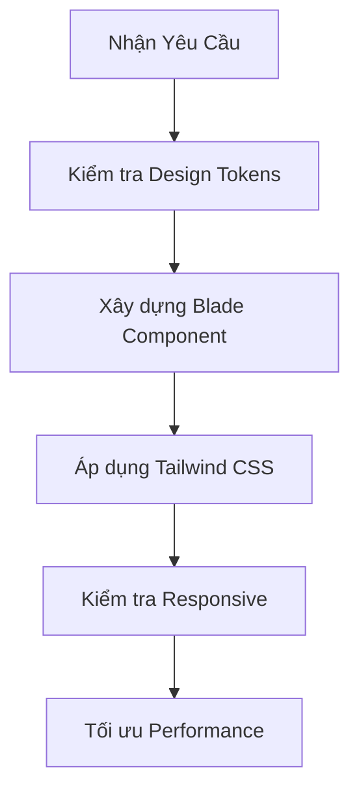

# 🎨 Quy Chuẩn Thiết Kế & Phát Triển Frontend
## Dự án: WallpaperHunt

Tài liệu này đóng vai trò là **Nguồn chân lý duy nhất (Single Source of Truth)** cho toàn bộ quy trình thiết kế, xây dựng và bảo trì giao diện người dùng (UI/UX) của dự án WallpaperHunt. Mọi thành viên khi thêm mới hoặc chỉnh sửa giao diện đều **bắt buộc** tuân thủ các quy tắc dưới đây nhằm đảm bảo tính đồng bộ và trải nghiệm cao cấp.

---

## 🚀 1. Triết Lý Thiết Kế (Design Philosophy)

WallpaperHunt hướng tới phong cách **Premium Light Mode** (Sáng & Hiện đại) kết hợp với **Soft Gradients** và **Glassmorphism**. Giao diện mang lại cảm giác:
- **Tinh tế & Chuyên nghiệp:** Sử dụng khoảng trắng (Whitespace) hợp lý, bóng đổ mềm mịn, bo góc lớn (`rounded-2xl`, `rounded-3xl`).
- **Sống động:** Sử dụng dải màu Gradient xanh dương - cyan và các hiệu ứng phát sáng (Glow effects).
- **Mượt mà (Fluidity):** Mọi tương tác đều có hiệu ứng chuyển cảnh mềm mại.

---

## 🎨 2. Hệ Thống Thiết Kế (Design System)

### 2.1 Bảng Màu Chủ Đạo (Color Palette)
Dự án sử dụng hệ màu sáng làm nền và màu xanh dương sống động làm điểm nhấn (theo phong cách Modern SaaS).

| Vai trò | Tên Token | Mã Màu | Ứng dụng |
| :--- | :--- | :--- | :--- |
| **Nền chính** | `bg-slate-50` | `#f8fafc` | Toàn bộ background của trang |
| **Nền phụ** | `bg-white` | `#ffffff` | Sidebar, Footer, Card nền |
| **Bề mặt (Surface)**| `bg-white/80` | `#ffffff` | Các phần tử nổi, hiệu ứng Glass |
| **Điểm nhấn (Accent)**| `text-blue-600`| `#2563eb` | Icon, link, trạng thái Active |
| **Nút chính (Primary)**| `bg-blue-600` | `#2563eb` | Các nút kêu gọi hành động (CTA) |
| **Chữ chính** | `text-slate-900` | `#0f172a` | Tiêu đề, nội dung chính |
| **Chữ phụ** | `text-slate-500` | `#64748b` | Chú thích, thời gian, mô tả |

> [!TIP]
> Tạo điểm nhấn bằng Gradient xanh-cyan: `bg-gradient-to-r from-blue-600 to-cyan-500`.

### 2.2 Typography
- **Font chữ chính:** `Inter`, `system-ui`, `-apple-system`, `sans-serif`.
- **Quy tắc phân cấp:**

| Thẻ | Tailwind Class | Cân nặng | Mục đích |
| :--- | :--- | :--- | :--- |
| `h1` | `text-3xl md:text-5xl`| `font-extrabold`| Tiêu đề trang chính |
| `h2` | `text-2xl md:text-3xl`| `font-bold` | Tiêu đề mục lớn |
| `h3` | `text-xl` | `font-semibold` | Tiêu đề Card, Widget |
| `p` | `text-base` | `font-normal` | Nội dung văn bản |
| `small`| `text-sm` | `font-medium` | Metadata, Thẻ tag |

---

## 🛠️ 3. Quy Chuẩn Tailwind CSS v4.0

Dự án tích hợp **Tailwind CSS v4.0**.
- Ưu tiên dùng hệ thống spacing chuẩn.
- **Mobile-First:** Viết class cho thiết bị di động trước.

### Cú pháp Glassmorphism chuẩn (Light Theme):
```html
<div class="bg-white/80 backdrop-blur-xl border border-slate-200/50 rounded-2xl shadow-xl shadow-slate-200/50">
    <!-- Nội dung nằm đây -->
</div>
```

---

## 🧩 4. Quy Chuẩn Component & Cấu Trúc Code

### 4.1 Quy tắc đặt tên (Naming Conventions)
- **Blade Components:** kebab-case.
- **CSS Classes:** Tuân theo chuẩn BEM hoặc gom nhóm Tailwind Class.

### 4.2 Cấu trúc một Component chuẩn (Blade + Tailwind)
```html
{{-- resources/views/components/primary-button.blade.php --}}
@props(['type' => 'button'])

<button type="{{ $type }}" 
    {{ $attributes->merge(['class' => 'inline-flex items-center justify-center px-6 py-3 border border-transparent text-base font-medium rounded-xl text-white bg-blue-600 hover:bg-blue-700 focus:outline-none focus:ring-2 focus:ring-offset-2 focus:ring-blue-500 shadow-lg shadow-blue-500/25 transition-all duration-300 ease-in-out hover:scale-[1.02] active:scale-[0.98]']) }}>
    {{ $slot }}
</button>
```

---

## ✨ 5. Trải Nghiệm Người Dùng (UX) & Thẩm Mỹ

### 5.1 Hiệu ứng Tương tác (Micro-interactions)
- **Hover:** Thay đổi trạng thái mượt mà.
  - Sử dụng: `transition-all duration-300 ease-out`.
  - Ví dụ: `hover:text-blue-600`, `hover:shadow-blue-500/20`.
- **Skeleton Loaders:** Luôn hiển thị khung xương khi tải.

### 5.2 Responsive Breakpoints
- **Mobile:** `< 640px`.
- **Tablet:** `sm:`, `md:`.
- **Desktop:** `lg:`, `xl:`.

---

## 🛠️ 6. Luồng Phát Triển Tính Năng Mới (Workflow)



> [!IMPORTANT]
> **ĐỊNH NGHĨA HOÀN THÀNH (DoD):** Một tính năng UI chỉ được coi là hoàn thành khi đã kiểm tra hiển thị tốt trên cả iPhone (Safari) và Android/PC (Chrome/Firefox).

---

## 📈 7. Tối Ưu Hiệu Suất & Độ Sắc Nét Hình Ảnh

1. **Chất lượng hình ảnh (High-Fidelity Wallpapers):**
   - Đảm bảo ảnh hiển thị **Rõ nét**, tuyệt đối không bị vỡ hạt hay mờ (Blurry).
   - Khi nén ảnh sang định dạng `WEBP`/`AVIF`, giữ chất lượng (Quality) từ **85% - 92%** để cân bằng hoàn hảo giữa dung lượng và độ sắc nét.
   - Luôn sử dụng `loading="lazy"` cho các ảnh nằm ngoài màn hình đầu tiên (Below the fold).
2. **Xử lý Thumbnails (Ảnh thu nhỏ):**
   - Khi tạo Thumbnails, kích thước ảnh phải gấp 1.5 - 2 lần kích thước hiển thị thực tế để hiển thị sắc nét trên các thiết bị màn hình Retina/High-DPI.
3. **Tính ổn định (Stability & Layout):**
   - Đặt trước thuộc tính `width` và `height` (hoặc `aspect-ratio`) cho thẻ ảnh để tránh hiện tượng giật lag layout (Cumulative Layout Shift - CLS) khi ảnh đang tải.
   - Sử dụng Skeleton Loaders kết hợp hiệu ứng mờ dần (Fade-in).
4. **Icons & Fonts:** Sử dụng SVG và Tự host file font chữ qua Vite.

---
*Tài liệu được cập nhật lần cuối vào: 2026-04-28*
